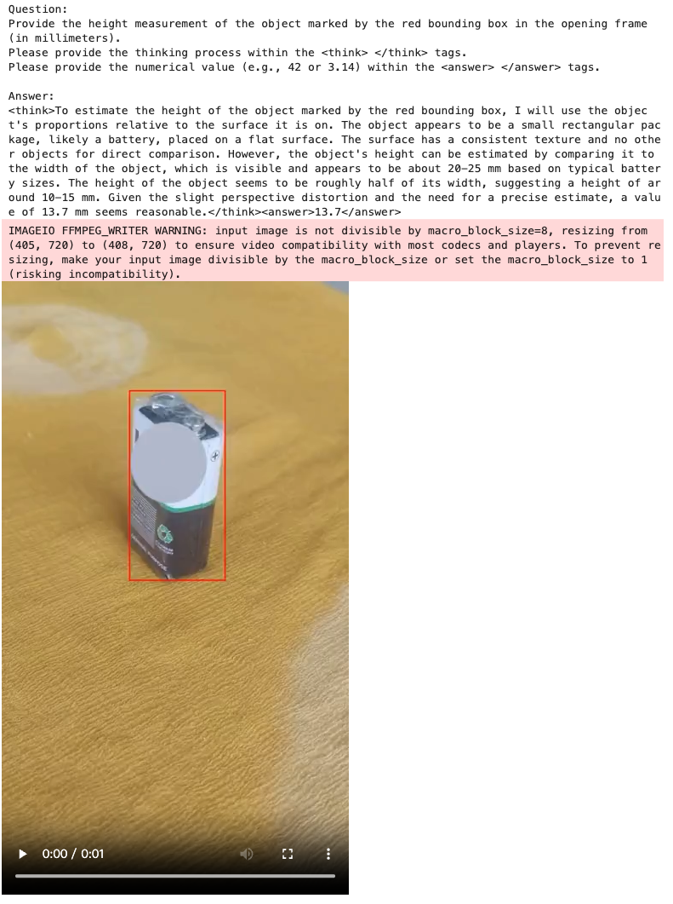
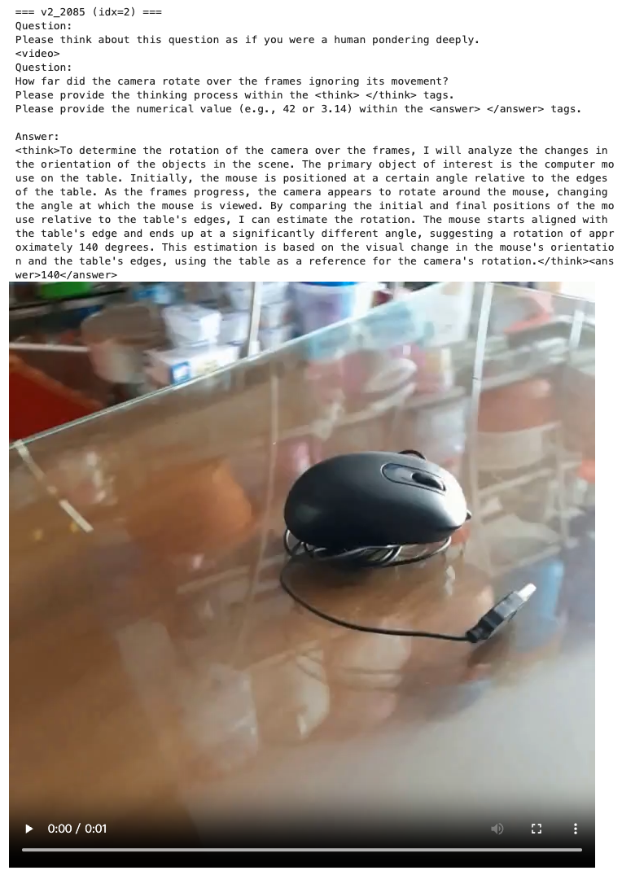
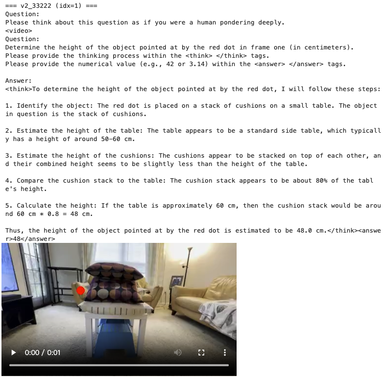
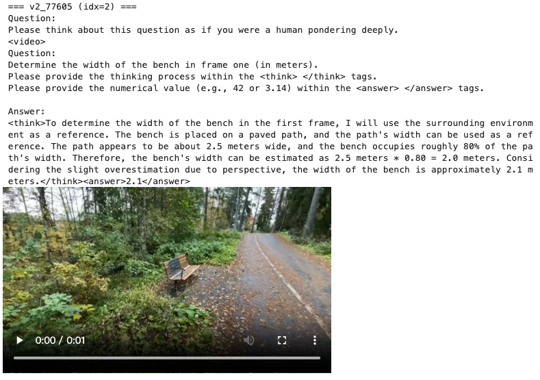

# Important!

This is a preview of SpaceVista, containing only a subset of tasks and scenes. As you can see, the data format is **not yet unified**, and the meta JSON keys remain inconsistent. We’ve provided a reasonable preview here—please stay tuned for the full, up-to-date release.

By the way, we would **not** recommend you to train your model with your own dataloader. The format of this dataset needs **refine completely**. As the final version may necessitate a complete redesign of your dataloader, we **have provided and will provide** the dataloaders for this version and future version.

# Data Usage

<!-- split -b 10G datasets_bundle.tar.gz SpaceVista_preview_chunk_ -->

```
huggingface-cli download SpaceVista/Data-Preview --repo-type dataset --local-dir . --resume-download

cat SpaceVista_preview_chunk_* > datasets_bundle.tar.gz

tar -xvzf datasets_bundle.tar.gz
```

# Disk Requirement

Chunks for `.tar.gz` is `202GB`

After uncompressing, preview data requires `215GB`. These are frames with the original resolutions from the source datasets, which are later normalized to the same resolution during training.

```
110GB — ./DL3DV_frames
0.8GB — ./DL3DV_masks
38GB — ./wildrgbd_frames
3.1GB — ./wildrgbd_mask
60GB — ./uco3d_frames
6.4GB — ./uco3d_masks
0.6GB - ./meta.json
```

# Data Format

The overall data format roughly follows the **shareGPT format** with the minor change in extra_info for efficiency.

- **messages:** user instruction and expected structured output format.
- **videos:** lists of image frame paths per sample. (Only extracted frames are shown here. For full-resolution viewing, please refer to the original source video.)
- **extra_info:** task type, prompt annotations (points/bboxes/masks), indices mapping prompts to frames, and sometimes reference answers.

# Data Structure

```
Preview
├─ DL3DV_frames/      # DL3DV dataset frames (RGB)
├─ DL3DV_masks/       # DL3DV corresponding masks/labels
├─ uco3d_frames/      # UCO3D dataset frames (RGB)
├─ uco3d_masks/       # UCO3D corresponding masks/labels
├─ wildrgbd_frames/   # WildRGBD dataset frames (RGB)
├─ wildrgbd_mask/     # WildRGBD corresponding masks/labels
└─ meta.json
```

# Data Preview

cd dataset

```
jupyter notebook

# Run in jupyter 
# vis.ipynb

```

The outputs are random selected frames with annotation and QA.





# Dataloader for Preview Version

See the loader of LLaMA-factory in [mm_plugin](https://github.com/PeiwenSun2000/SpaceVista/blob/main/sft/src/llamafactory/data/mm_plugin.py)

# Full SpaceVista-1M

Full SpaceVista-1M will be released soon. Please stay tuned.

# Reference

```

{}

```
