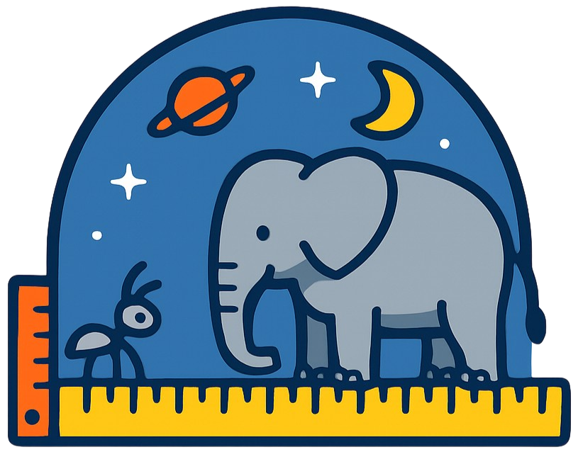
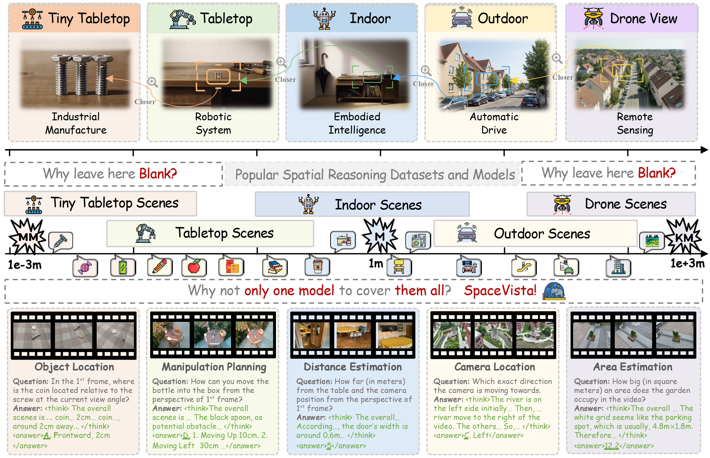

#  **SpaceVista**: All-Scale Visual Spatial Reasoning from $mm$ to $km$

<p align="center">
          &nbsp&nbsp🤗 <a href="https://huggingface.co/datasets/SpaceVista/Data-Preview">Hugging Face</a>&nbsp&nbsp | &nbsp&nbsp 📑 <a href="https://arxiv.org/abs/2510.09606">Paper</a> &nbsp&nbsp | &nbsp&nbsp ⚙️ <a href="https://github.com/PeiwenSun2000/SpaceVista">Github</a> &nbsp&nbsp | 🖥️ <a href="https://peiwensun2000.github.io/mm2km/">Home Page</a>&nbsp&nbsp
</p>


Peiwen Sun $^{\*}$, Shiqiang Lang $^{\*}$, Dongming Wu, Yi Ding, Kaituo Feng, Huadai Liu, Zhen Ye, Rui Liu, Yun-Hui Liu, Jianan Wang, Xiangyu Yue

Keywords:    

The official repo for SpaceVista: All-Scale Visual Spatial Reasoning from $mm$ to $km$.

## Outlines
- [💥 News 💥](https://github.com/PeiwenSun2000/SpaceVista/tree/main?tab=readme-ov-file#-news-)
- [👀 About SpaceVista](https://github.com/PeiwenSun2000/SpaceVista/tree/main?tab=readme-ov-file#spacevista)
- [📊 SpaceVista-1M Dataset](https://github.com/PeiwenSun2000/SpaceVista/tree/main/dataset)
- [🏆 Usage](https://github.com/PeiwenSun2000/SpaceVista/tree/main?tab=readme-ov-file#dataset-usages)
- [📝 Evaluation](https://github.com/PeiwenSun2000/SpaceVista/tree/main?tab=readme-ov-file#evaluation)

## 💥 News 💥
[2026.5.28] 📦 Our SpaceVista-1M is released at <a href='https://huggingface.co/datasets/SpaceVista/SpaceVista-Full'></a>.

[2026.5.28] 🎯 Our SpaceVista-Bench is released at <a href='https://huggingface.co/datasets/SpaceVista/SpaceVista-Bench'></a>.

[2026.5.10] 🏆 The Guinness World Records data used in our paper is released at <a href='https://huggingface.co/datasets/SpaceVista/Guinness_World_Records'></a>.

[2026.5.2] 🎉 Our paper is accepted by ICML 2026. See you in Seoul.

[2025.10.10] Our preview SFT code base is released for preview. <a href='https://github.com/PeiwenSun2000/SpaceVista'></a>.

[2025.10.10] Our preview 100K subset of SpaceVista-1M is now available at <a href='https://huggingface.co/datasets/SpaceVista/Data-Preview'></a>.

[2025.10.10] Our initial paper is now accessible at <a href='https://arxiv.org/abs/2510.09606'></a>.

## Overall Structure

*  Training Dataset: [SpaceVista-1M](https://huggingface.co/datasets/SpaceVista/SpaceVista-Full) <a href='https://huggingface.co/datasets/SpaceVista/SpaceVista-Full'></a>.
*  Evaluation Dataset: [SpaceVista-Bench](https://huggingface.co/datasets/SpaceVista/SpaceVista-Bench) <a href='https://huggingface.co/datasets/SpaceVista/SpaceVista-Bench'></a>.
*  SFT training: [SFT code for SpaceVista](https://github.com/PeiwenSun2000/SpaceVista/tree/main/sft) <a href='https://github.com/PeiwenSun2000/SpaceVista'></a>.
*  Evaluating: [Evaluation code for SpaceVista](https://github.com/PeiwenSun2000/SpaceVista/tree/main/eval) <a href='https://github.com/PeiwenSun2000/SpaceVista'></a>.

## SpaceVista

<p align="center">
     <br>
</p>

Spatial reasoning is the ability to perceive, interpret, and act across spatial scales, from millimeter-sized components to distant aerial scenes. All-scale spatial reasoning is fundamental to next-generation intelligent systems and supports diverse applications: mm sensing for advanced manufacturing, cm and m perception for embodied agents, 10m operation for autonomous driving, and 100m for drone-based sensing.
Despite progress, existing work shows clear limitations in both model design and dataset coverage. Current scene perception research mostly targets indoor scenes, narrow object classes, and limited spatial ranges, and lacks training paradigms engineered for end to end, cross scale reasoning. SpaceVista addresses this gap by presenting the first systematic optimization across both data and model dimensions to enable robust, full-scene spatial reasoning.

# Training Data

SpaceVista-1M: Available at <a href='https://huggingface.co/datasets/SpaceVista/SpaceVista-Full'></a>.

```bash
# Download SpaceVista-1M
huggingface-cli download SpaceVista/SpaceVista-Full --repo-type dataset --local-dir ./SpaceVista-1M
```

# Evaluation Data

SpaceVista-Bench: Available at <a href='https://huggingface.co/datasets/SpaceVista/SpaceVista-Bench'></a>.

```bash
# Download SpaceVista-Bench
huggingface-cli download SpaceVista/SpaceVista-Bench --repo-type dataset --local-dir ./SpaceVista-Bench
```

# Evaluation

We provide API-based evaluation scripts that work with any OpenAI-compatible API (OpenRouter, OpenAI, POE, etc.). No GPU required.

```bash
cd eval
pip install openai pillow numpy tqdm pandas
export API_KEY="your-api-key-here"
```

For APIs that support **frame (image) input**:

```bash
python evaluate_api.py --model qwen/qwen2.5-vl-72b-instruct
```

For APIs that support **video input** (requires `ffmpeg`):

```bash
python evaluate_api_video.py --model qwen/qwen2.5-vl-72b-instruct
```

To use a different API provider, override `--base_url`:

```bash
# OpenAI
python evaluate_api.py --model gpt-4o --base_url https://api.openai.com/v1

# POE
python evaluate_api.py --model gpt-4o --base_url https://api.poe.com/v1
```

See the [eval/README.md](eval/README.md) for full argument reference, resume support, and output format.

# Usage

In case you want to train the Qwen2.5-VL-7B model with SpaceVista, please refer to the [sft](https://github.com/PeiwenSun2000/SpaceVista/tree/main/sft) folder for detailed instructions.

# Reference

If you find this repo useful, please cite our papers:

```
@article{sun2025spacevista,
  title={SpaceVista: All-Scale Visual Spatial Reasoning from mm to km}, 
  author={Sun, Peiwen and Lang, Shiqiang and Wu, Dongming and Ding, Yi and Feng, Kaituo and Liu, Huadai and Ye, Zhen and Liu, Rui and Liu, Yun-Hui and Wang, Jianan and Yue, Xiangyu},
  journal={arXiv preprint arXiv:2510.09606},
  year={2025}
}
```
